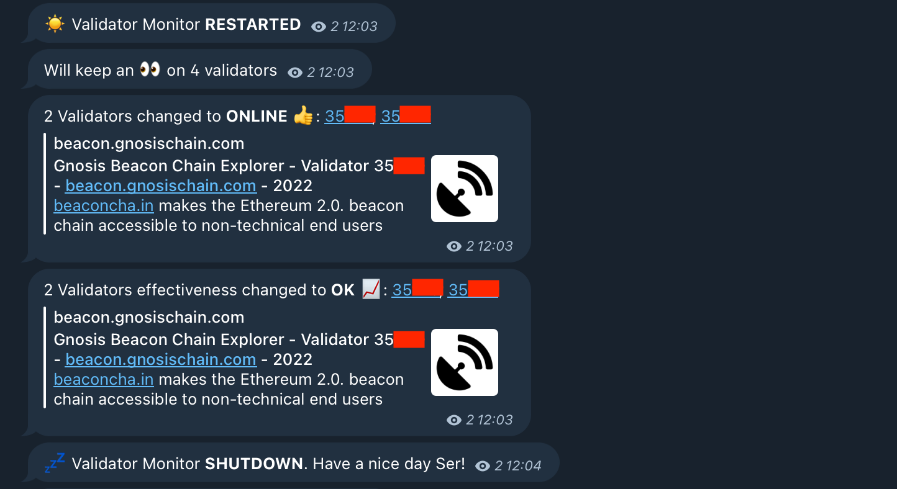
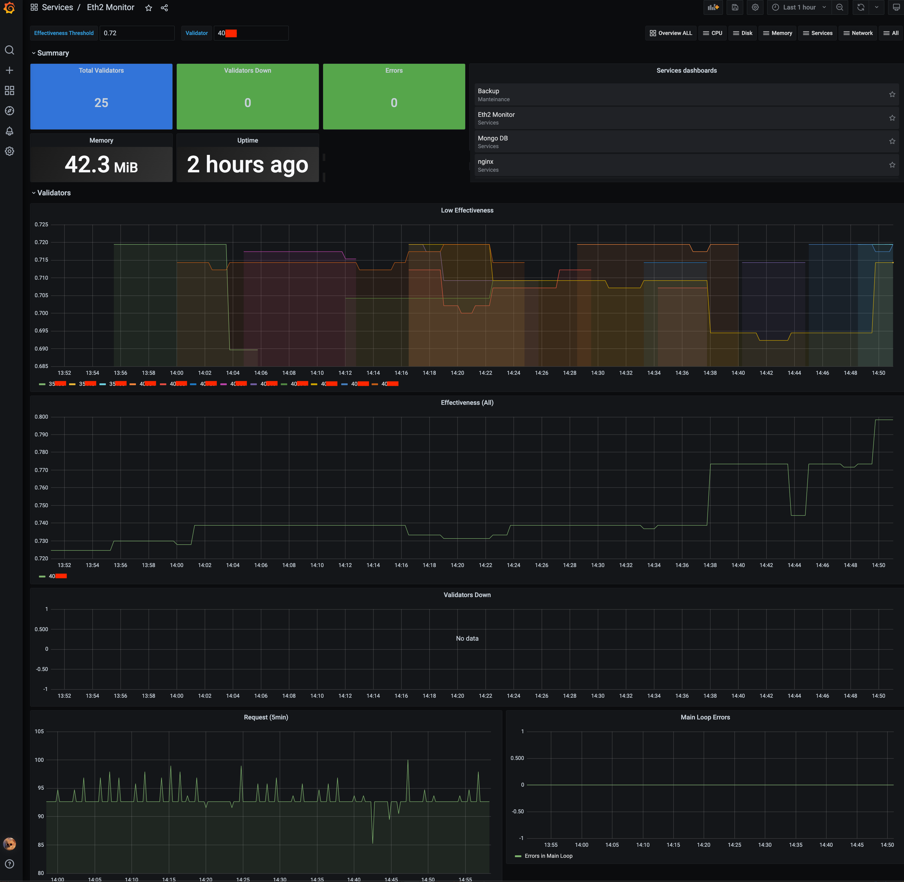

# ETH2 Monitor
Checks a series of validators and notifies if they are down or if their effetiveness fall below a threshold.

<p align="center">
  
</p>

On it's default configuration it will monitor a list of validators, and log their status and effectiveness. 

However, there's two additional features that can be enabled independently of each other:
* **Telegram Notifications**: 
  * Notifies every time one of the validators goes offline/online
  * Notifies every time a validator falls below a effectiveness threshold
* **Prometheus**:
  * Reports the online/offline status of each validator
  * Reports the effectiveness of each validator
  * Reports many relevant metrics, like error counts, request, performance metrics, etc


<p align="center">
  
</p>

> Inspired by https://github.com/uijin/eth2-validator-monitor

# Quickstart: Run the monitor

> **Requirements**: Install here if you don't have it https://docs.docker.com/compose/install

```bash
# Create a new directory
mkdir eth2-monitor && eth2-monitor

# Create a config file (config.yml)
#   Template: https://raw.githubusercontent.com/anxolin/eth2-monitor/main/config-example.yml
curl https://raw.githubusercontent.com/anxolin/eth2-monitor/main/config-example.yml > config.yml

# Create a docker-compose file (docker-compose.yml)
#     Template: https://raw.githubusercontent.com/anxolin/eth2-monitor/main/docker-compose-example.yml
curl https://raw.githubusercontent.com/anxolin/eth2-monitor/main/docker-compose-example.yml > docker-compose.yml
```

Your `config.yml` looks like:

```yaml
check_health:
  # Notify if effectiveness falls bellow the theshold (null to disable effectiveness notifications)
  # notify_effectiveness_threshold: null
  notify_effectiveness_threshold: 0.66

  # It will notify when the check fails by this numnber of times in a row. The highest will define the periodicity 
  # after that number is reached
  #
  #   i.e  [15, 60, 1440], and assuming a polling_wait of 60 seconds
  #       - Notify after 15 failures, so it will notify after 15min failing
  #       - Notify after 60min
  #       - Notify after 24h (and every 24h from this moment)
  notify_error_count_thresholds: [15, 60, 1440]

  # Waiting time between health checks
  polling_wait: 60

  # Delay between request of large lists (i.e. delay when quering validator states in batches)
  batch_request_delay: 0.2

  # Notify validator state changes only after some seconds 
  notify_delay_seconds: 300
  
beacon_chain:
  # Ethereum
  base_url: https://beaconcha.in
  # Gnosis Chain
  #base_url: https://beacon.gnosischain.com

# Telegram notifications (Disabled by default, see README on how to set it up)
telegram: null
# telegram:
#   access_token: "your-access-token"
#   chat_id: -1000000000

# Expose Prometheus metrics
prometheus: null
# prometheus:
#   port: 8000

validators:
  # Eth1 withdraw account (alternative way to specify the list of validators)
  #   IMPORTANT: Maximun 500 validators, otherwise you will need to use "public_keys"
  eth1_withdraw_account: null
  # eth1_withdraw_account: 'your eth1 withdraw account'

  # Validator's public keys to monitor
  public_keys:
    - 0xa1d1ad0714035353258038e964ae9675dc0252ee22cea896825c01458e1807bfad2f9969338798548d9858a571f7425c
    - 0xb2ff4716ed345b05dd1dfc6a5a9fa70856d8c75dcc9e881dd2f766d5f891326f0d10e96f3a444ce6c912b69c22c6754d
    - 0x8e323fd501233cd4d1b9d63d74076a38de50f2f584b001a5ac2412e4e46adb26d2fb2a6041e7e8c57cd4df0916729219
    - 0xa62420543ceef8d77e065c70da15f7b731e56db5457571c465f025e032bbcd263a0990c8749b4ca6ff20d77004454b51  
```

Make sure your `docker-compose.yml` should look like:

```yml
version: "3.9"
services:
  bot:
    image: anxolin/eth2-monitor:latest
    ports:
      # Expose Prometheus metrics (you need to also enable them in the config)
      - "8000:8000"
    environment:
      - LOGLEVEL=INFO
    volumes:
      - ./config.yml:/app/config.yml
    restart: always
```


Run it with docker-compose:

```bash
docker-compose up
```

## Telegram notifications
In order to setup Telegram notifications, you will need to:
- Create a bot using [Botfather](https://core.telegram.org/bots#3-how-do-i-create-a-bot), write down the access token (needed in the config)
- Create a channel in telgram
- Add the bot to the channel
- Use any of these methods to [get the chat_id](https://stackoverflow.com/questions/32423837/telegram-bot-how-to-get-a-group-chat-id)

Once you have the `access_token` and `chat_id` you just add them in the configuration file.

```ini
telegram:
  access_token: "your-access-token"
  chat_id: -11111111111111

# If you want to receive notifications if the validatos fall below the threshold
check_health:  
  notify_effectiveness_threshold: 0.66
  # ...
```

## Prometheus
In order to expose the prometheus metrics define the port in the config:

```ini
prometheus:
  port: 8000
```

If you are running the monitor with **docker-compose**, remember to make sure you are exposing the same port.


# Development
See [Development](./development.md)