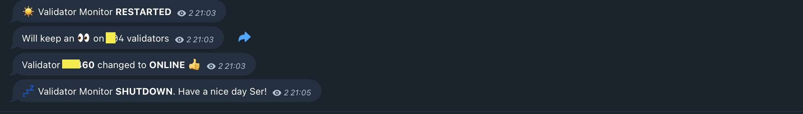

# ETH2 Monitor
Checks a series of validators and notifies to Telegram if they are down

<p align="center">
  
</p>

> Inspired by https://github.com/uijin/eth2-validator-monitor

# Quickstart
Rename `config-example.yml` to `config.yml` and modify configuration.

```yaml
check_health:
  # Waiting time between health checks
  polling_wait: 60
  
beacon_chain:
  # Ethereum
  base_url: https://beaconcha.in
  # Gnosis Chain
  #base_url: https://beacon.gnosischain.com

telegram:
  access_token: "your-access-token"
  channel_id: -1000000000

validators:
  # Eth1 withdraw account (alternative way to specify the list of validators)
  #   IMPORTANT: Maximun 500 validators, otherwise you will need to use "public_keys"
  eth1_withdraw_account: null
  # eth1_withdraw_account: 'your eth1 withdraw account'

  # Validator's public keys to monitor
  public_keys:
    - 0x000000000000000000000000000000000000000000000000000000000000000000000000000000000000000000000000
    - 0x000000000000000000000000000000000000000000000000000000000000000000000000000000000000000000000001
    - 0x000000000000000000000000000000000000000000000000000000000000000000000000000000000000000000000002
    - 0x000000000000000000000000000000000000000000000000000000000000000000000000000000000000000000000003
    - 0x000000000000000000000000000000000000000000000000000000000000000000000000000000000000000000000004
    - 0x000000000000000000000000000000000000000000000000000000000000000000000000000000000000000000000005  
```


Run it with docker-compose.

> Install here if you don't have it https://docs.docker.com/compose/install/

```bash
docker-compose up
```


## Docker build
> It's simpler to just use docker-compose

```bash
docker build . -t eth2-monitor
docker run -v $(pwd)/config.yml:/app/config.yml eth2-monitor
```

To see the logs

```bash
# get the running CONTAINER ID
docker ps

docker logs -f <CONTAINER ID>
```

# Development

```bash
# Setup virtual env
python3 -m venv ENV
source ENV/bin/activate

# Install dependencies
pip install -r requirements.txt

# Run
python src/main.py
```